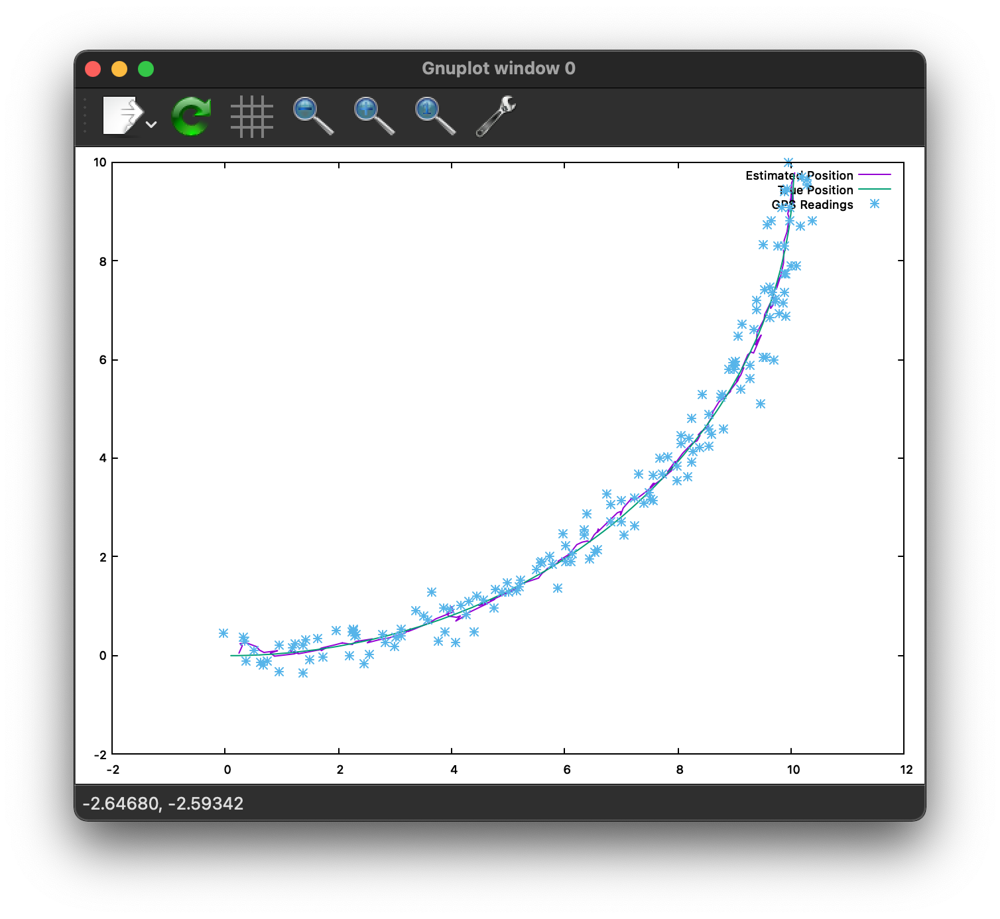

# CppRobotics
 A C++ translation of PythonRobotics by AtsushiSakai

## Motivation
This project is space to work on my C++ skills and to get more familiar with common robotics algorithms.

## Code style
I'm new to this, so if you have any suggestion please feel free to let me know.
 
## Screenshots
The EKF for a noisy GPS.

## Tech/framework used
<b>Built with</b>
- [GNUplot](https://www.gnuplot.info)

## How to use?
Just build each program in thier build folders and run, a graph should appear.

## Credits
This repo is a largely a rework and translation of PythonRobotics by AtsushiSakai see [here](https://github.com/AtsushiSakai/PythonRobotics) for the original work and algorithm documentation. 
