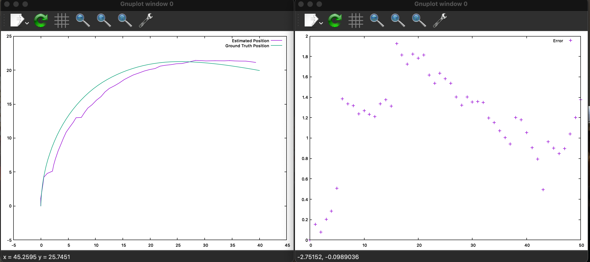

# Visual Odometry
 A simple implementation of a monocular visual odometry algorithm.

## Motivation
Being interested in autonomous systems, I wanted to practice with OpenCV in C++ and freshen up on the basic concept of VO.

## Code style
I'm new to this, so if you have any suggestion please feel free to let me know.
 
## Screenshots
Sample output from a section of KITTI data.


## Tech/framework used
<b>Built with</b>
- [OpenCV](https://opencv.org/)
- [GNUplot](https://www.gnuplot.info)
- [Eigen](https://eigen.tuxfamily.org/index.php?title=Main_Page)

## How to use?
1. Create and enter a build directory
```
mkdir build & cd build
```
2. Run cmake 
```
cmake ..
```
3. Make and run the executable
```
make
./VisualOdometry
```